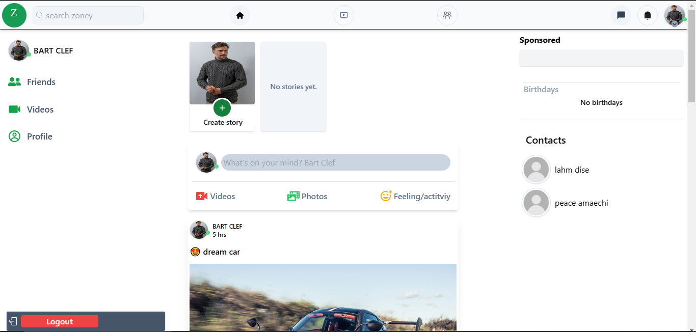
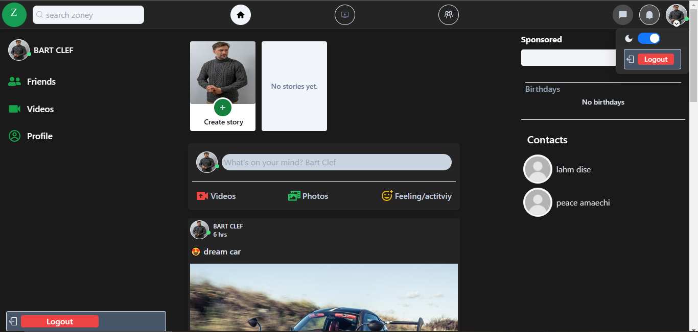
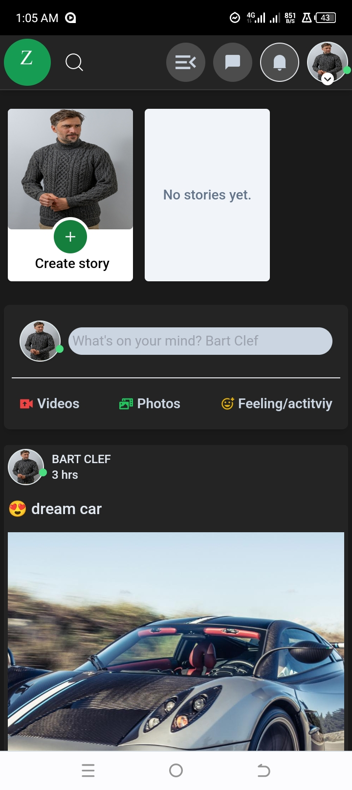
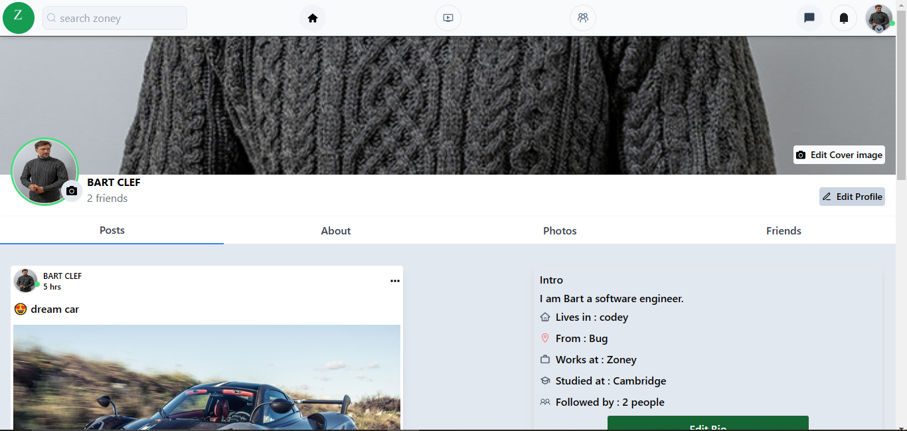
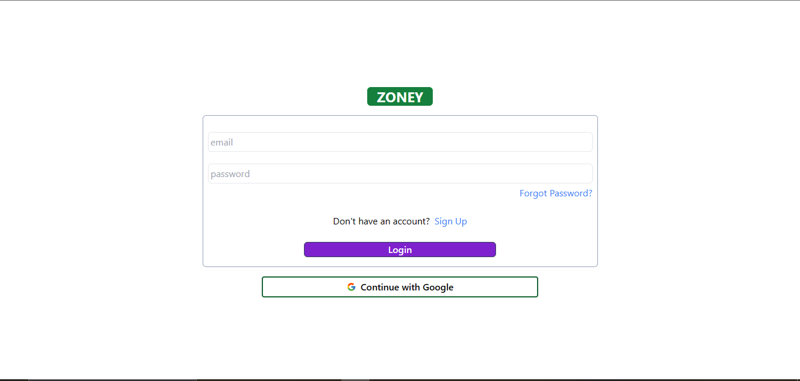
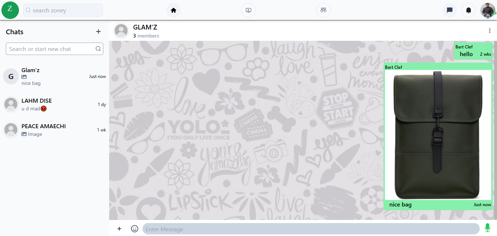
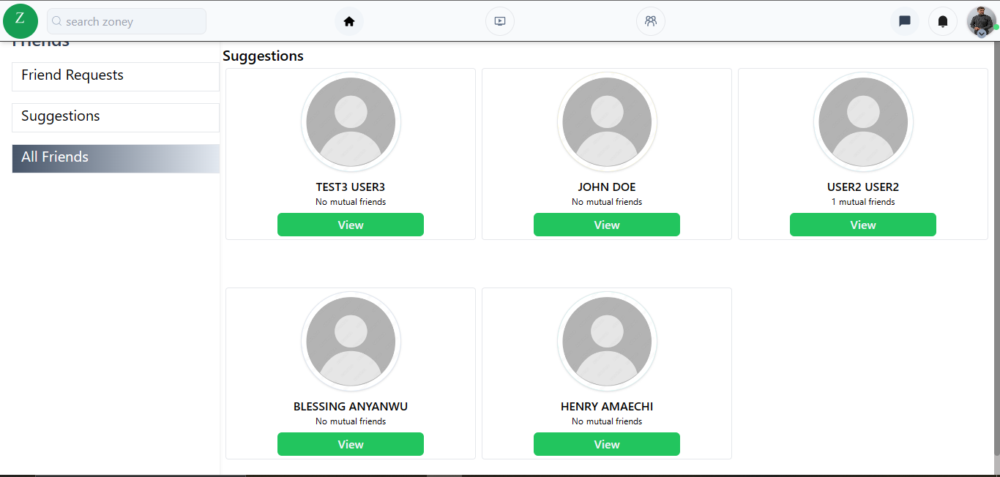

# Introduction to Zoney

Zoney is a social media web application built using the MERN stack. The app provides a rich set of features including real-time chat, user authentication, multimedia sharing, dark mode and more.

## Table of Contents

- [Features](#features)
- [Technologies Used](#technologies-used)
- [Installation](#installation)
- [Usage](#usage)
- [Contributing](#contributing)
- [Contact](#contact)

## Features

- User authentication and authorization (JWT)
- Real-time chat functionality (Socket.io)
- Media uploads using Multer and Cloudinary
- Email notifications using Nodemailer
- Scheduled tasks with node-cron
- State management with Redux and Redux Toolkit
- Persistent state with Redux Persist
- Responsive design with Ant Design (antd)
- Emoji support with Emoji Picker React
- Secure environment variables with dotenv
- CORS enabled
- Development convenience with Concurrently and Nodemon

## UI Snapshots

### Homepage


### Homepage Darkmode


### Mobile Homepage


### Profile Page


### Login Page


### Chat Page


### Friends Page


## Technologies Used

### Client

- **React**: Library for building user interfaces
- **Redux & Redux Toolkit**: State management
- **Redux Persist**: Persistent state across sessions
- **Axios**: Promise-based HTTP client
- **Ant Design (antd)**: Design system for creating modern interfaces
- **React Icons**: Icons for React applications
- **React Router DOM**: Declarative routing
- **React Helmet**: Document head management
- **React Toastify**: Toast notifications
- **Emoji Picker React**: Emoji picker component
- **Firebase**: Google Authentication
- **JS-Cookie**: Cookie manipulation
- **React Loading**: Loading indicators
- **Socket.io-client**: Real-time communication
- **Lodash**: Utility library
- **Moment.js**: Date manipulation
- **Testing Library**: Testing utilities

### Server

- **Node.js**: JavaScript runtime
- **Express**: Web framework for Node.js
- **MongoDB**: NoSQL database
- **Mongoose**: MongoDB object modeling
- **Multer**: Middleware for handling multipart/form-data
- **Cloudinary**: Cloud-based image and video management
- **Nodemailer**: Email sending service
- **JWT**: JSON Web Tokens for authentication
- **dotenv**: Environment variable management
- **CORS**: Cross-Origin Resource Sharing
- **Helmet**: Security headers middleware
- **Bcryptjs**: Password hashing
- **Body-parser**: Parse incoming request bodies
- **Cookie-parser**: Parse cookies
- **Node-cron**: Task scheduling
- **Socket.io**: Real-time communication
- **Morgan**: HTTP request logger
- **Validator**: String validation and sanitization
- **Nodemon**: Development tool for auto-restarting Node.js server

### Development Tools

- **Concurrently**: Running multiple commands concurrently

## Installation

### Prerequisites

- Node.js and npm installed
- MongoDB database

### Clone the Repository

```bash
git clone https://github.com/CHIBUZOR-1/Zoney.git
cd Zoney
```

### client
```bash
$ cd client # go to client folder
$ npm install # install packages
$ npm start # run the client side statically with react-scripts
```

### Server
start the server

```bash
$ cd SERVER # go to the server folder
$ npm install # install all packages
$ npm run server # start the server
```
## Environment variables
The following variables are required to run the program in the root directory.
```bash
lOCALHOST=Port_number
JWT_SECRET=your_jwt_secret
MONGOOSE_URL=your_mongoose_url
ORIGIN=your_client_url
URL=your_server_url
EMAIL=your_email_for_nodemailer
PASSWORD=email_password
SECURE=false_for_development_and_true_for_production
PORTZ=port_used_for_nodemailer
HOST=host_for_nodemailer_hosting_service
SERVICE=nodemailer_hosting_service
CLOUDINARY_CLOUD_NAME=your-cloudinary-cloud-name
CLOUDINARY_API_KEY=your-cloudinary-api-key
CLOUDINARY_API_SECRET=your-cloudinary-api-secret
```

### Using Concurrently

```bash
cd Zoney
npm run dev

```

## LOGIN ACCOUNTS

Email: test1@yahoo.com
Password: 224422


## Contact

If you have any questions, feedback, or would like to connect, feel free to reach out to me.

- **Name:** Chibuzor Henry Amaechi
- **Email:** amaechihenrychibuzor@gmail.com

Feel free to contact me through any of the channels above. I'm open to collaborations and discussions related to Flutter development or any other projects.


### Summary:
- **Project Description**: Clear description of Glee Social as a social media app with chat functionality.
- **Features**: Detailed list of features.
- **Technologies Used**: Comprehensive list of both client and server technologies.
- **Installation and Usage**: Clear instructions for setting up and running the application.
- **Contributing**: Guidelines for contributing to the project.
- **Contact Information**: Additional channels for connecting with you.

Feel free to adjust any details or add any additional information you'd like. Let me know if there's anything else you need! 😊

